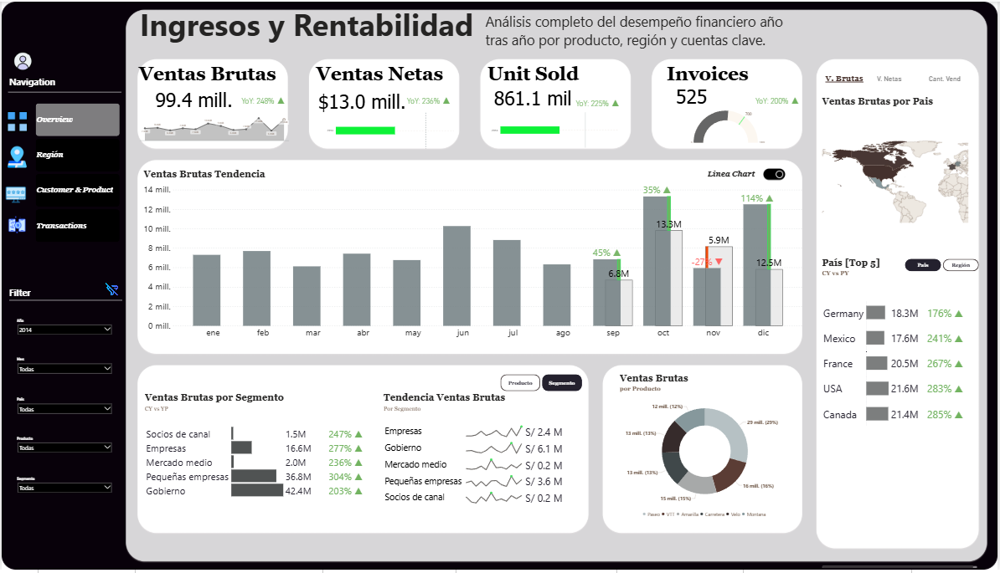
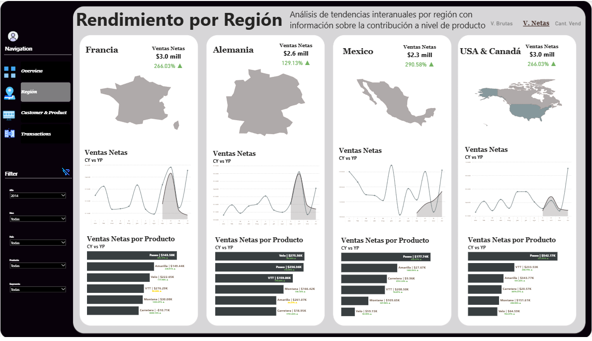
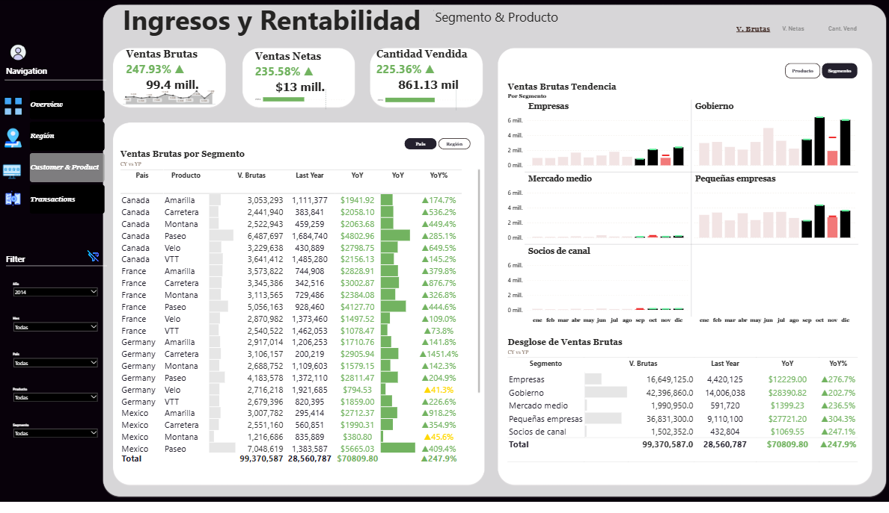
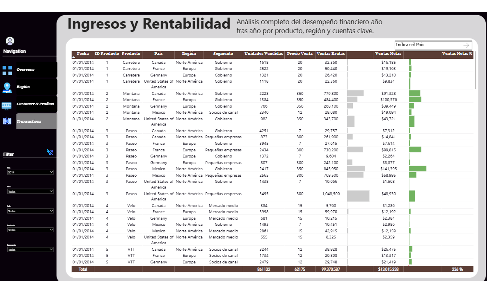

# 📊 Proyecto Power BI: Análisis Empresarial

Bienvenido a mi proyecto de análisis de datos con **Power BI**, donde transformé datos crudos en insights accionables para la toma de decisiones estratégicas. Este reporte fue desarrollado para demostrar capacidades analíticas aplicadas a un caso empresarial.

---

## 🚀 Objetivo del Proyecto

 Se utilizaron técnicas de modelado de datos y visualización avanzada para construir un dashboard ejecutivo interactivo.

---

## 🧩 Tecnologías y herramientas

- Microsoft Power BI Desktop
- Power Query
- DAX
- Servicio Power BI en la nube

---

## 🌐 Accede al Informe Interactivo

🔗 **Haz clic aquí para ver el informe completo en Power BI Service**:  
👉 [Ver informe publicado](https://app.powerbi.com/view?r=eyJrIjoiMmY1Nzg1MDctZmExMy00MTkyLTliZWEtZjYyMWI0OGY4YjM3IiwidCI6IjUyOWMyMmEyLTUxZTAtNGM1OC1hYmQyLTczNzVhYjY0OWMyMiJ9)

---

## 📁 Dashboard de Ventas 

-  Hoja Principal reflejando los principales indicadores del proyecto

- Rendimiento por País
  

 
- Rentabilidad por Productos y Segmentos
  

- Cuadro resumen
   

---

## 📁 Archivos en este repositorio

- `informe.pbix`: Archivo fuente de Power BI con todo el modelo, medidas DAX y visualizaciones.
- `README.md`: Documento explicativo del proyecto.
- `/screenshots`: Imágenes de vista previa del informe (opcional).

---

## 📌 Notas adicionales

- Para visualizar el archivo `.pbix`, necesitas tener instalado Power BI Desktop.
- El informe online es solo de lectura, pero puedes descargar el `.pbix` y adaptarlo a tus propios datos.

---

## 🧠 Autor

**Nombre:** [Anthony Paul Sulgaray Ramos]  
**GitHub:** [@thonystar](https://github.com/thonystar)  

---
